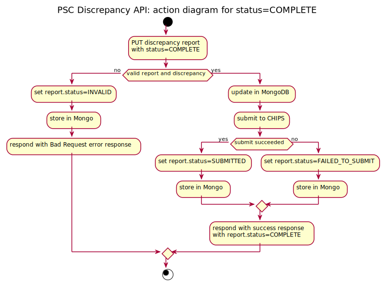

# psc-discrepancies.api.ch.gov.uk
This API is for servicing requests from the PSC Discrepancies web service and creating and updating a PSC discrepancy report and discrepancies in a MongoDB.

Upon completing a report, the client sends a status update of `COMPLETED`, which signals the API to then send the discrepancy report to CHIPS.

## Requirements

In order to build this service locally you need:

- [Java](http://www.oracle.com/technetwork/java/javase/downloads/jdk8-downloads-2133151.html)
- [Maven](https://maven.apache.org/download.cgi)
- [Git](https://git-scm.com/downloads)
- [MongoDB](https://www.mongodb.com)

## Installation

To download this repository, run the following from the command line and change into the directory:

```
git clone git@github.com:companieshouse/psc-discrepancies.api.ch.gov.uk.git

cd psc-discrepancies.api.ch.gov.uk
```

#### Configuration

The following are environment variables necessary to run the API:

##### chs-configs/(environment)/psc.discrepancies.api.ch.gov.uk/env:

* _PSC_DISCREPANCIES_API_APPLICATION_NAME_: Used in structured logging to display the application the log line belongs to
* _PSC_DISCREPANCIES_MONGODB_URL_: Points at the MongoDB instance for that environment
* _PSC_DISCREPANCIES_DATABASE_: Refers to the database that holds the collections for the application data
* _PSC_DISCREPANCY_REPORT_SUBMISSION_URI_: The link to the CHIPS REST interfaces submission for a PSC Discrepancy for the corresponding CHIPS environment

##### chs-configs/(environment)/global_env:

* _PSC_DISCREPANCIES_API_PORT_: Port number for where the API is deployed
* _PSC_DISCREPANCIES_API_CH_GOV_UK_URL_: Used to allow ERIC to route requests through the API

#### Vagrant

Installing and running this API in Vagrant requires an update of the `vagrant-development-v2` repository and then running `./clean.sh` and `./setup.sh`.

CHS Configs must be updated with a value for `PSC_DISCREPANCY_REPORT_SUBMISSION_URI` according to the chips environment it should messasge. Documentation on how to find the correct values can be found here https://companieshouse.atlassian.net/wiki/spaces/TCE/pages/2704277768/Configuring+Development+Env+to+communicate+with+CHIPS

To start this API in Vagrant, use the following command: `ubic start psc.psc-discrepancy-api`

It is recommended to run this API in Vagrant rather than outside of Vagrant because of the necessary environment variables, which can be found in: `src/main/resources/application.properties`

#### Other Environments

The API is deployed via Concourse or by the release team.

## Usage

The usage of this API is primarily through accessing the web app `psc-discrepancies.web.ch.gov.uk`. At this time (May 12, 2020) there is no requirement to make this a public API.

#### Using the REST API directly
The API specification can be found in the `spec` directory.
##### PSC Discrepancy Report

HTTP requests can be sent to the API via a REST client, e.g. Postman, with the following URL as the base URL: 

`http://api.chs-dev.internal:18553/psc-discrepancy-reports`

This URL can be used to create a new PSC Discrepancy Report via a __POST__ request
with a body of a PscDiscrepancyReport with only its `obliged_entity_type`
field filled in, for example:
```json
{
  "obliged_entity_type" : "Financial institution"
}
```

A successful 201 Created response will hold the URL of the created report in
a Location header and a copy of the created report in its body. This created report
is important, as it contains the `etag` value necessary for any subsequent PUTs.

The location of the resource will take the form
`http://api.chs-dev.internal:18553/psc-discrepancy-reports/{report-id}` and can then be used to
update the report (via a __PUT__ request) with any combination the following fields:
```json
{
    "etag": "see note below",
    "obliged_entity_type": "Financial institution",
    "obliged_entity_email": "jsmith@email.co.uk",
    "company_number": "00006400",
    "obliged_entity_telephone_number": "07788991122",
    "status": "COMPLETE"
}
```

__etag__ note that the etag is initialised in the first POST and changes with each
successful PUT. Thus the __current etag value__ in the system can be found in the
PscDiscrepancyReport or PscDiscrepancy in the body of the response to a POST or PUT.
You can also retrieve it by using a GET for that resource. You must use the current
etag value in any PUT, or you will get an error response. The use of etag in this
way is standard Companies House design and is meant to prevent races between
different clients on the same resource. This is unlikely to happen with just a
single web client for a given resource, but nevertheless this is CH best practice.

__GET__ requests can also be executed to retrieve individual reports

##### PSC Discrepancy

A report for a company may, within the model, have multiple discrepancies. The
current web design only allows for one discrepancy to be raised, but the design
of the API allows multiple discrepancies to exist within a report.

Given a PSC Discrepancy Report existing at URL that looks like:

`http://api.chs-dev.internal:18553/psc-discrepancy-reports/{report-id}`

... to create a PSC Discrepancy for that report, __POST__ the PscDiscrepancy to
the following URL: 

`http://api.chs-dev.internal:18553/psc-discrepancy-reports/{report-id}/discrepancies`

The body of the POST needs to contain the PscDiscrepancy JSON, but you should only
fill out the details field, for example:

```json
{
  "details": "Wrong birthday on John Smith. Should be 01/01/1991 instead of 01/01/1992"
}
```

A __GET__ request can also be done on the discrepancies URL shown above to list
all discrepancies recorded within a report.

Furthermore, a __GET__ request can be done on the following URL to retrieve an individual discrepancy: 

`http://api.chs-dev.internal:18553/psc-discrepancy-reports/{report-id}/discrepancies/{discrepancy-id}`

## Support
The support process for dealing with a bug in this API follows the same process as all other CHS services.
The following are the main problems that could occur with the services.
1. Web service has a POST or PUT rejected: this could occur if there is a validation failure in the
API that causes it to reject the web services request. This is unlikely as the web service has
its own validation, but the issue could occur.
1. Web service sets report status to COMPLETE, causing validation of the complete report and that fails for
some reason. Again, this is unlikely, but it would result in the status of the report being set to
INVALID.
1. Web service sets report status to COMPLETE, the report is valid and the API attempts to send the report
to CHIPS REST Interfaces, but the attempt fails, either because of an error inside CHIPS REST Interfaces or
because it is unavailable. In this case, the report status will be set to FAILED_TO_SUBMIT.

## Design
The sequence diagram below shows a high-level overview of the interactions between the user, web service, API service and CHIPS.


Note that some elements are missing from the diagram, to keep the diagram simple.

### An overview of how the different systems interact.
The CHIPS portion of the design can be found at:
https://companieshouse.atlassian.net/wiki/spaces/TC/pages/1625456764/5MLD+CHIPS+Design+Documentation+-+PscDiscrepancyService
... which may not be accessible, unless you are inside the Companies House network.

The web service design can be found here:
https://github.com/companieshouse/psc-discrepancies.web.ch.gov.uk/

In order to keep the web service as stateless as possible, the REST service
 is used to store the growing model. Each webscreen contains one or two
 pieces of information that are added to the growing report; when that page's data
 is submitted to the web service, the web service in turn stores that pages information
 in the API.

In a different design, the growing report and
 its discrepancy data would be stored in a web-service specific session store. We
 rejected this as the session store is not really fit for purpose at the moment.
 
The design of the system is simplified by storing the growing report in the API and
 having the web service add to it incrementally. When the web journey
 is finished and the report is complete, the web service updates the status of the
 report, using a PUT on the API to change the status to COMPLETE. This signals the
 API to validate the report as a whole and send it on to CHIPS.

### Data storage
The API Service, like most other Companies House services, stores its back-end
 data in MongoDB, and that is not shown here. Each successful POST or PUT causes
 data to be stored in MongoDB. The model used by the DB can be found in the Java
 package `uk.gov.ch.psciscrepanciesapi.models.entity`.
 
### Validation
1. JSON data submitted to the API is validated: invalid data is rejected, leaving
the stored model unchanged.
1. In the incremental design of growing the report with POSTs and PUTs, each POST
 and PUT validates the individual fields that are currently set there, leaving unset
 fields unvalidated.
1. Only when the status is changed to COMPLETE are the whole report and its child
 discrepancies validated. At this point, all mandatory fields in the report and any
 child discrepancies must be set and there must be at least at least one report.

### Whitelist copying of data into API
Data submitted to the API by POST and PUT is not blindly saved into the API.

Specifically: each API object consists of a mixture of:
* 'client-settable' fields that may be set by the API client (such as the
PscDiscrepancyReport's companyNumber)
* 'non-client-settable' fields that are only meant to be set by the API, such as
`kind`, `etag`, or `links`.
By copying the client-settable fields in and skipping the non-client-settable
fields, we prevent malicious or inadvertent alteration of those non-client-settable
fields.

### Status=COMPLETE: a more detailed flow
Here we can see a more detailed flow within the API for what happens when the status
of a report changes to COMPLETE.


### API project code structure
* The project uses an old-fashioned directory structure for a RESTful service, with the
project directories being split according to  component nature, e.g. MongoDB entity,
Spring REST controller... rather than by REST endpoint.
* The project is essentially a standard Spring Boot REST app, using code from the
Companies House REST Service common library (https://github.com/companieshouse/rest-service-common-library)
to simplify some of the code, e.g. making it easier to get the Errors payload right.
* There are two endpoints, each with a controller and service, for
PscDiscrepancyReport and PscDiscrepancy respectively.

### Missing from the current design
1. Authentication, particularly role-based authentication allowing privileged operations
such as listing all reports, DELETE of a report...
1. Exception handler.
1. Interceptors. Specifically, there are no interceptors for authentication, logging,
or to check that a POSTed PscDiscrepancy actually has the parent PscDiscrepancyReport
implied by its path.
1. DELETE from any endpoint, though that would be dangerous without some for of
role based authentication.
1. UPDATE of a PscDiscrepancy, as it was not needed. It would be useful for support though.
1. A more flexible design would allow you to POST a
PscDiscrepancyReport that had any combination of settable fields set, including none.
We had to refactor the PscDiscrepancyReport creation code when the first page that
created the PscDiscrepancyReport changed, as this changed the nature of the POST
made from that web page to the API.
1. Structured logging
1. We do not cater for the following scenario: if a PscDiscrepancyReport has been
marked as COMPLETE and has been successfully submitted to CHIPS, then its status
updated to SUBMITTED - given this, should we allow further PUTs on the report?
1. Filtered requests on the reports collection, filtering by report status. If we added
fields for created_at and modified_at, then this collection could be filtered for
reports with a status of INVALID or FAILED_TO_SUBMIT or
(status=COMPLETE and modified_at is older than dateX), which would be useful for support.
